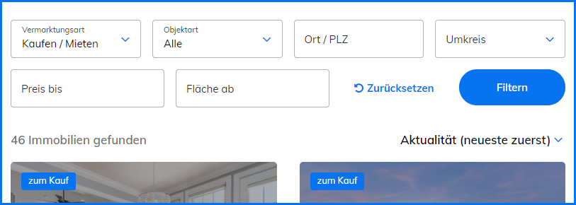

# Filter

Mithilfe von Immobilien-Filtern lassen sich Objekte in Kombination mit einer Immobilien-Ergebnisliste suchen und filtern. Ein eingestellter Filter lässt sich als Inhaltselement oder als Frontend-Modul in einer Seite einbinden.

### Funktionsweise

Filter können ähnlich wie Formulare im Contao Formulargenerator aufgebaut und verwaltet werden. Anstelle von Formularfeldern stehen dabei in der Filterverwaltung sogenannte Filter-Widgets zur Verfügung, über die ein Filter ganz nach den eigenen Wünschen eingerichtet werden kann.

### Neuen Filter erstellen

Neue Filter können über **Neuer Filter**  erstellt werden.

### Titel & Weiterleitung

Titel

Dient der Identifizierung im Backend.

Filteralias

Der Filteralias ist eine eindeutige Referenz, die anstelle der numerischen Filter-ID verwendet werden kann.

Weiterleitungsseite

Hier kann die Seite eingetragen werden, zu der man beim Abschicken des Filters weitergeleitet wird.

?> Verfügen Objekttypen über eine eigene Referenzseite, muss die Weiterleitungsseite ggf. auf die Übersichtsseite aller Immobilien weitergeleitet werden, um stets zur korrekten Unterseite weitergeleitet zu werden.

### Filter-Einstellungen

Objektgruppen

Hier können die Objektgruppen ausgewählt werden, die für die Filterung berücksichtigt werden sollen.

Bei Änderung Seite wechseln

Hier kann eingestellt werden, ob der Filter automatisch abgeschickt wird bei Änderung der Objektart.

Standardfilter

Standardfilter werden angezeigt, wenn kein spezieller Objekttyp ausgewählt wurde.&#x20;

?> Standardfilter sollten den kleinsten gemeinsamen Nenner aller Filtermöglichkeiten der verfügbaren Objekttypen anbieten. In der Regel sind dies _Preise_ und _Flächen_, allerdings kann auch die _Anzahl der Zimmer_ relevant sein, wenn keine Grundstücke angeboten werden.

Verfügbare Optionen: Zimmer

Eine kommagetrennte Liste der verfügbaren Optionen im Filter für die _Anzahl der Zimmer_. Mit Hilfe eines Punktes können auch halbe Zimmer angegeben werden (1, 1.5, 2, 2.5, 3, etc.).
