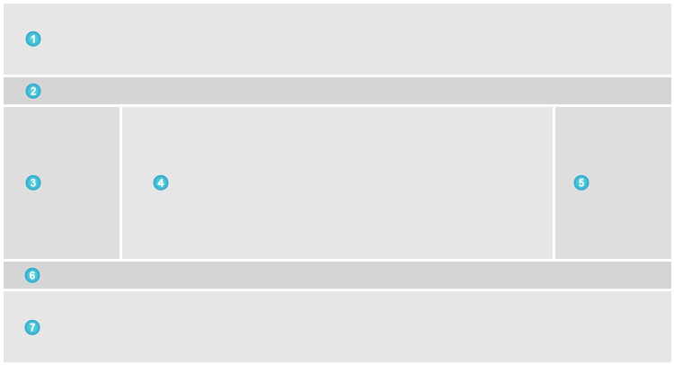

# Immobilien-Exposé

Das "Immobilien-Exposé" Modul ermöglicht die Zusammenfassung und Ausgabe der Exposé-Module, um eine Immobilien im Detail zu präsentieren.

### Einstellungen

Exposé-Module

Hier können die zuvor unter Exposé-Module definierten Module in beliebiger Reihenfolge ausgewählt und in die für ein Exposé vordefinierten Layoutbereiche eingefügt werden.

Referenzen erlauben

Erlaubt die Darstellung von Referenz-Immobilien in diesem Modul

### Layoutbereiche

Das "Immobilien-Exposé" Modul liefert eigene Layoutbereiche, welche über das Exposé-Module Feld befüllt werden können. Folgende Layoutbereiche stehen dabei zur Verfügung.

1️⃣ Kopfzeile \
2️⃣ Über dem Inhaltsbereich\
3️⃣ Linke Spalte\
4️⃣ Hauptspalte\
5️⃣ Rechte Spalte\
6️⃣ Unter dem Inhaltsbereich\
7️⃣ Fußzeile

?> Layoutbereiche bilden ausschließlich die Struktur der Ausgabe ab. Die Anordnung und dessen Darstellung müssen selber über CSS definiert werden.

### Template

mod_realEstateExpose

