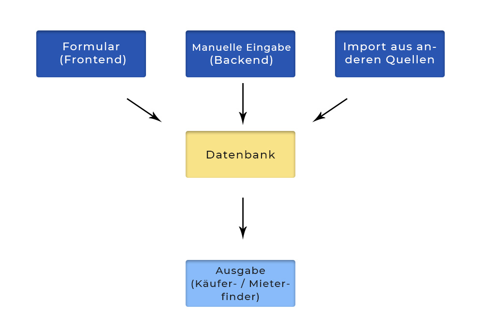

# Käufer- / Mieterfinder


Die `Käufer- / Mieterfinder` Erweiterung liefert ein Tool, welches Verkäufern / Immobilienbesitzern anhand der eigenen Immobilien-Eckdaten ermöglicht, passende Interessenten zu finden. Dabei können bis zu drei Bereiche ausgegeben und kombiniert werden. 

1. **Ermittlung der Immobilien-Eckdaten \(Filter\)** _Ermöglicht die Filterung der Interessenten anhand eigener Immobilien-Eckdaten_ 
2. **Anzeige der gefundenen Interessenten \(Liste\)** _Zeigt anonyme Daten der Interessenten wie Anzahl der Zimmer oder Preisvorstellungen._ 
3. **Kontaktaufnahme \(Formular\)** Beliebiges Formular, welches über den von Contao mitgelieferten Formulargenerator angelegt werden kann.


Der Käufer- / Mieterfinder zeigt ausschließlich Daten \(Suchanfragen\) an, welche manuell im System angelegt, durch andere Systeme importiert wurden oder über ein Formular \(Frontend\) in die dafür vorgesehene Tabelle \(`tl_search_criteria`\) gespeichert werden.


### Installation



```bash
$ composer require contao-estatemanager/lead-matching-tool
```



Installation direkt über GitHub:

[https://github.com/contao-estatemanager/lead-matching-tool](https://github.com/contao-estatemanager/lead-matching-tool)



Nach der Installation muss das [Contao-Installtool](https://docs.contao.org/manual/de/installation/contao-installtool/) aufgerufen und die Datenbank aktualisiert werden. 

### Suchanfragen

Suchanfragen dienen als Grundlage des Käufer- / Mieterfinders und können über verschiedene Wege in das System überführt werden.




Mit der Erweiterung [onOffice API Import](onoffice-api-import.md) können alle benötigten Daten für den Käufer- / Mieterfinders direkt aus onOffice importiert und aktuell gehalten werden.


### Konfiguration

Um das Tool im Frontend über das mitgelieferte Modul ausgeben lassen zu können, muss vorerst eine Konfiguration im Backend angelegt werden.

#### Titel / Grundkonfiguration

🔹`Titel`

_Dieser Titel wird ausschließlich zu Beschreibungszwecken im  Backend verwendet._

🔹_`Vermarktungsart`_

_Hier stehen drei Auswahlmöglichkeiten zur Verfügung. Bei Auswahl einer fest definierten Option wie **Kauf** oder **Miete**, wird die Auswahl der Vermarktungsart im Frontend unterbunden._

🔹_`Regionen Eingabemodus`_

_Definiert die Möglichkeit, wie Regionen im Frontend ausgegeben und gewählt werden können. Regionen können im Reiter "Regionen" verwaltet werden. Bei Auswahl einer Umkreissuche \(empfohlen\) werden Längen- und Breitengrade in den Regionen vorausgesetzt._

#### _Daten-Konfiguration_

🔹_`Vermarktungsarten`_

_Sofern die Vermarktungsart nicht fest definiert wurde, kann der Besucher aus den hier ausgewählten Vermarktungsarten wählen._

🔹`Objektarten`

_Definiert die wählbaren Objektarten im Frontend. Objektarten können im Reiter "Objektarten" verwaltet werden._

#### _Suchanfragen / Liste_

🔹`Feld Meta-Daten`

_Definiert die auszugebenden Felder der Suchaufträge innerhalb der Liste._

🔹_`Überschrift`_

_Eine Überschrift, welche oberhalb der Liste ausgegeben wird._

🔹_`Beschreibung`_

_Ein Beschreibungstext, welcher oberhalb der Liste ausgegeben wird._

🔹_`Gesamtanzahl der Beiträge`_

_Definiert die Gesamtanzahl der Beiträge. Bei 0 werden alle Beiträge ausgegeben._

🔹`Elemente pro Seite`

_Definiert die Anzahl pro Seite \(Paginierung\)._

🔹_`Listen Element-Template`_

_Definiert das zu verwendende Template für Listenelemente._

🔹_`Anzahl anzeigen`_

_Gibt die Anzahl der gefundenen Interessent aus und aktualisiert die Zahl sofort, sofern ein Filter verwendet und durch den Besucher angepasst wird._

#### _Filter / Immobilienformular_

🔹`Filter hinzufügen`

_Definiert, ob ein Filter für Immobilien-Eckdaten aktiviert und angezeigt wird._

🔹_`Überschrift`_

_Eine Überschrift, welche oberhalb des Filters ausgegeben wird._

🔹_`Beschreibung`_

_Ein Beschreibungstext, welcher oberhalb der Liste ausgegeben wird._

🔹_`Liste immer anzeigen`_

_Definiert, ob die Liste bereits ohne Filterung ausgegeben werden darf._

🔹_`Immobilien-Formularfelder`_

_Definiert die Felder, welche im Filter ausgegeben werden. Das Feld Vermarktungsart wird nur ausgegeben, sofern keine feste Vermarktungsart unter "Daten-Konfiguration" gewählt wurde. Das Feld **Umkreis** wird nur berücksichtig, sofern eine Umkreissuche unter **Regionen Eingabemodus** ausgewählt wurde._

#### _Kontaktformular_

🔹`Kontaktformular hinzufügen`

_Definiert, ob ein Kontaktformular ausgegeben werden soll._

🔹_`Überschrift`_

_Eine Überschrift, welche oberhalb des Formulars ausgegeben wird._

🔹_`Beschreibung`_

_Ein Beschreibungstext, welcher oberhalb des Formulars ausgegeben wird._

🔹_`Kontaktformular immer anzeigen`_

_Definiert, ob das Kontaktformular bereits ohne Filterung ausgegeben werden darf._

🔹_`Kontakt-Formular`_

_Definiert das auszugebende Formular, welches zuvor im Formulargenerator gebaut wurde._

### Module

Hier finden Sie eine Übersicht neuer \(🟢\) Module.



Gibt das Tool "Käufer- / Mieterfinder" anhand einer Konfiguration aus.

**Einstellungen**

🔹`Konfiguration`

_Die zu verwendende Konfiguration._

**Template**

🔸`mod_lead_matching`

🔸`search_criteria_item_default`



### Lizenz

Für diese Erweiterung ist eine Lizenz erforderlich. Zum Erwerb einer Lizenz folge bitte den Schritten unter [Lizenzen](../lizenzen.md).

